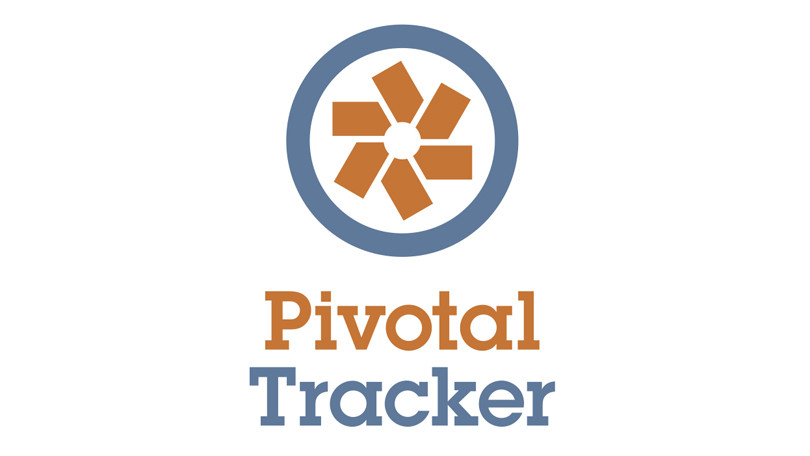

# MBTI-BACKEND

#### This application serves an an API for the frontend [here](https://github.com/igbominadeveloper/mbti-frontend)

=================================================================

## Project Management



[Pivotal Tracker](https://www.pivotaltracker.com/n/projects/2486976)

## Technologies

Laravel

===================================================

## How to setup

===================================================

Confirm that you have docker installed

```
$ docker --version

```

Create a .env file and copy the .env.example file into it

```
$ touch .env
```

```
$ cp .env.example .env
```

Pull and Build docker containers

```
$ docker-compose up -d
```

Confirm that all containers are up and running

```
$ docker-compose ps

```

Your app should be running on [localhost](0.0.0.0:8000)

Test that you can access `http://localhost:8000/api/v1/questions`


This App is setup to use sqlite databse so there is no need to migrate the database
